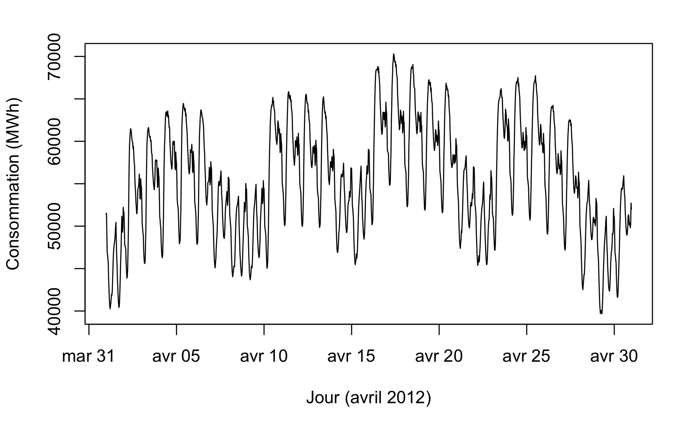
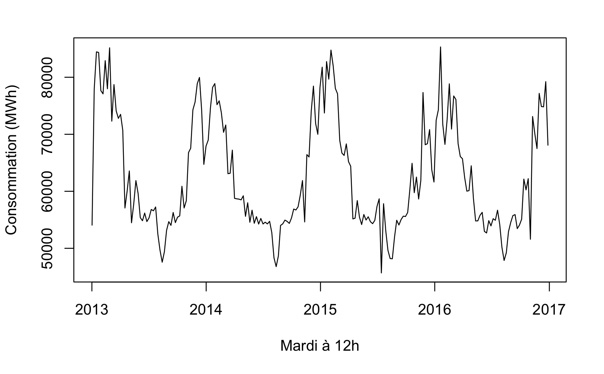
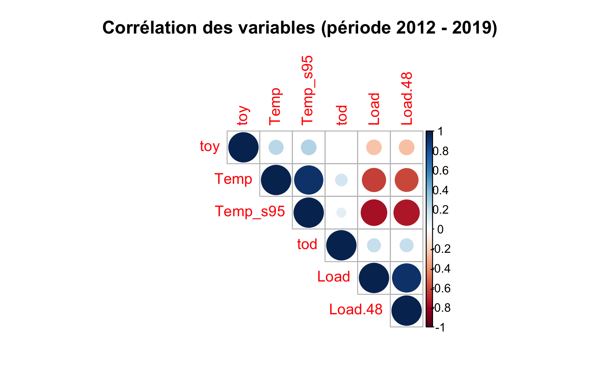
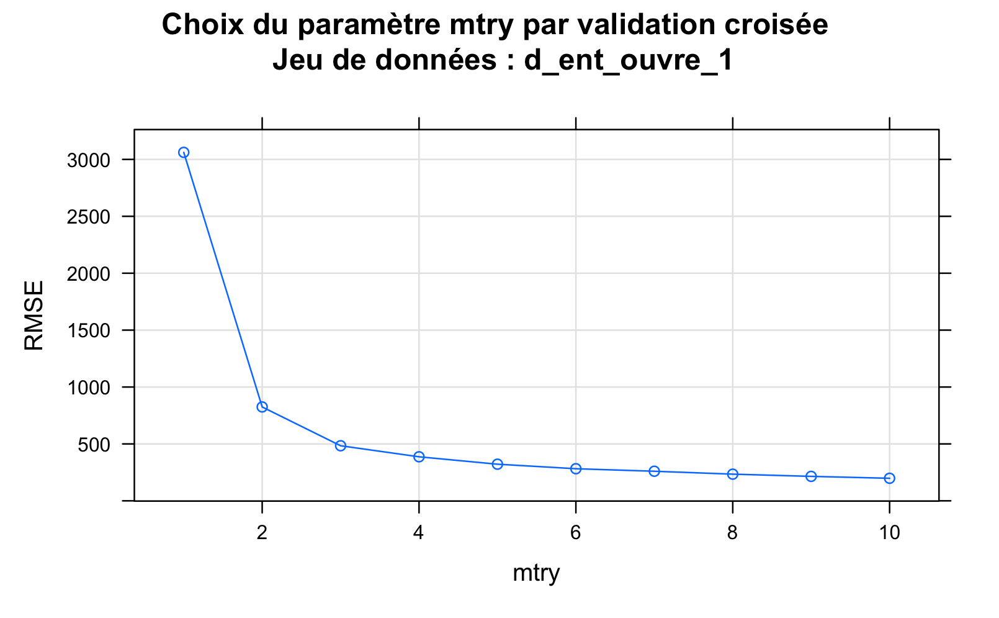
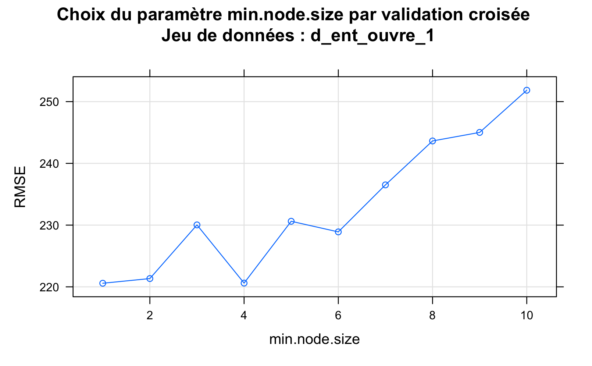
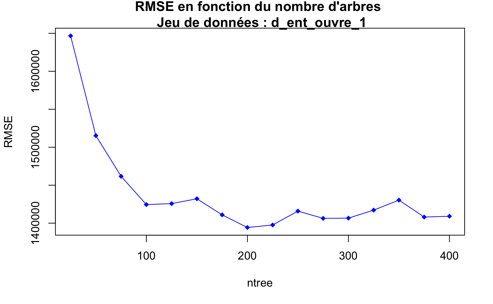

<style>
body {
text-align: justify}
</style>

```{r setup, include=FALSE}
knitr::opts_chunk$set(echo = TRUE)
```


Prédire la consommation d'électricité en France est un problème central, notamment pour la gestion du parc de production d'électricité français, dont le nucléaire, énergie peu modulable, représente une part importante. Dans ce projet, nous abordons cette question, qui rentre dans le cadre de la prévision de séries temporelles, en faisant appel à un large éventail de méthodes utilisant le machine learning.


## 1 Importation et prétraitement des données

```{r packages, echo=FALSE, include=FALSE}
rm(list=objects())

library(tidyverse)
library(readr)
library(dplyr)
library(lubridate)
library(xts)
library(mgcv)
library(mgcViz)
library(gridExtra)
library(yarrr)
library(qgam)
library(magrittr)
library(rpart)
library(party)
library(tree)
library(rpart.plot)
library(progress)
library(plotmo)
library(caret)
library(randomForest)
library(ranger)
library(opera)
library(corrplot)
library(vip)
library(dygraphs)
library(mltools)
library(data.table)
library(caret)
library(forecast)
library(RColorBrewer)


set.seed(1)

load("DONNEES/data.rda")
load("MODELES/GAM.rda")
load("MODELES/forets_ouvre.rda")
load("MODELES/bagging_gam.rda")
load("MODELES/boosting_arbres.rda")
load("MODELES/stacking_forets.rda")
load("MODELES/stacking_boosting.rda")
load("MODELES/qgam.rda")
```

Les données que nous avons utilisées sont des données EDF, qui nous ont été fournies directement par Yannig Goude. Nous avons donc pu nous concentrer sur les modèles sans avoir à nettoyer la base de données. Elles concernent la consommation électrique globale française (particuliers, entreprises et bâtiments publics confondus), échantillonnée par demi-heure de janvier 2012 à octobre 2022. Il y a en tout 24 variables, ce qui fait un total de $4.5\times 10^{6}$ observations.

### 1.1 Les principales variables du problème

Les variables que nous avons exploitées sont les suivantes.

  - Variables temporelles
    + **tod** : time of day, valeur numérique entre 0 et 1 indiquant le moment de la journée
    + **toy** : time of year, valeur numérique entre 0 et 1 indiquant le moment de l'année
    + **Month** : entier indiquant le mois
    + **WeekDays** : chaîne de caractères indiquant le jour de la semaine
    + **BH** : 1 si l'on est un jour férié, 0 sinon
    + **DLS** : 1 si l'on est en heure d'hiver, 0 sinon
    + **Summer_break** : variable à deux niveaux (0 et 10) pour indiquer les vacances d'été
    + **Christmas_break** : variable à deux niveaux (0 et 20) pour indiquer les vacances de Noël
    
  - Variables de consommation électrique (valeurs numériques)
    + **Load** : consommation dans toute la France échantillonnée au pas demi-heure
    + **Load.48** : consommation 24 heures (soit 48 demi-heures) avant
  - Prévisions RTE (valeurs numériques)
    + **Forecast_RTE_dayahead** : prévision de la consommation réalisée la veille (entre 18h et 20h) par RTE pour le lendemain
    + **Forecast_RTE_intraday** : prévision de la consommation réalisée une heure avant par RTE
  - Variables liées à la température (valeurs numériques)
    + **Temp** : température moyenne mesurée par un ensemble de stations météo en France métropolitaine
    + **Temp_s95** : lissage exponentiel de Temp, avec un facteur de lissage $\alpha = 0.95$
    + **Temp_s99** : lissage exponentiel de Temp, avec un facteur de lissage $\alpha = 0.99$
    + **Temp_s95_min** : minimum des températures mesurées par les différentes stations météo, après lissage avec $\alpha = 0.95$
    + **Temp_s99_min** : minimum des températures mesurées par les différentes stations météo, après lissage avec $\alpha = 0.99$
    + **Temp_s95_max** : maximum des températures mesurées par les différentes stations météo, après lissage avec $\alpha = 0.95$
    + **Temp_s99_max** : maximum des températures mesurées par les différentes stations météo, après lissage avec $\alpha = 0.99$.

### 1.2 Analyse descriptive préliminaire

Commençons par afficher la consommation électrique sur un mois, par exemple avril 2012.

```{r, echo=FALSE, include=TRUE}

```


On observe plusieurs périodicités dans la série temporelle :

- des oscillations journalières, de période 24h, avec des pics de consommation à certaines heures
- une périodicité hebdomadaire, avec une nette différence entre les jours ouvrés et les week-ends (ceux-ci coïncidant avec une consommation plus faible).

On s'attend aussi à avoir une périodicité annuelle. Pour la voir, nous représentons la consommation entre 2012 et 2014 pour un jour de la semaine fixé (par exemple le mardi) à une heure donnée (ici 12h), sinon il y a trop de données pour que les courbes soient lisibles.

```{r, echo=FALSE, include=TRUE}

```

On voit que la consommation est nettement plus importante l'hiver, et l'on retrouve les vacances d'été et les vacances de Noël en creux.

Ces observations nous incitent à traiter différemment chaque heure de la journée, et à distinguer les jours ouvrés des jours fériés, ce que nous faisons dans la sous-partie suivante. Quelles sont ensuite les variables explicatives les plus pertinentes pour prédire la consommation ? Nous ferons une étude plus approfondie dans la partie sur les forêts aléatoires, en nous fondant sur l'importance des variables, mais nous pouvons dans un premier temps afficher la corrélation entre les variables.

```{r, echo = FALSE, include = TRUE}

```

La température (telle quelle ou lissée) apparaît comme étant très anticorrélée à la consommation, ce qui est naturel : lorsqu'il fait froid, les bâtiments sont chauffés, ce qui consomme beaucoup. L'effet de la climatisation lorsqu'il fait chaud compense un peu cette tendance, mais implique une augmentation moindre de la consommation. La consommation de la veille, **Load.48**, est au contraire très corrélée à **Load**. Quant à **tod** et **toy**, elles sont assez faiblement corrélées à **Load** car la tendance s'inverse au fil de leur augmentation : par exemple pour **toy**, la corrélation est d'abord négative, car plus on s'éloigne de janvier et plus les températures remontent, induisant une baisse de la consommation, mais dès que l'automne puis l'hiver reviennent, la corrélation devient positive, et les deux effets se compensent.

### 1.3 Découpage du jeu de données

En vue d'appliquer des modèles d'apprentissage, il nous faut séparer les données qui ont été obtenues dans des conditions trop différentes, pour que l'hypothèse de données identiquement distribuées soit raisonnablement satisfaite. Tout d'abord, les données de la période covid (notamment celles de l'année 2020) ne peuvent vraisemblablement pas être traitées comme celles des années précédentes. Nous choisissons donc :

- la période de 2012 à 2018 inclus comme ensemble d'entraînement
- l'année 2019 comme ensemble de validation.

Nous enlevons ensuite les jours fériés, qui correspondent à un changement ponctuel de la consommation, et nous séparons les jours ouvrés des week-ends, en vertu des observations réalisées dans la sous-partie précédente. Nous allons nous concentrer dans la suite sur le cas des jours ouvrés, la prédiction pour les week-ends étant très similaire et risquant d'alourdir le rapport inutilement.

Pour avoir des modèles aussi précis que possible, mais aussi alléger le coût d'entraînement, puisque notre jeu de données est assez volumineux, nous avons entraîné un modèle différent par demi-heure. Nous avons sélectionné 24 demi-heures sur 48 (les premières demi-heures de chaque heure), pour faciliter l'affichage des résultats : cela ne change rien aux méthodes étudiées. Nous obtenons ainsi les jeux de données :

- **d_ent_ouvre_i** pour $i=0,\dots,23$, où l'on n'a gardé que les jours ouvrés dans l'ensemble d'entraînement **d_ent**, à l'heure $i$,
- **d_test_ouvre_i** pour $i=0,\dots,23$, où l'on n'a gardé que les jours ouvrés dans l'ensemble de validation **d_test**, à l'heure $i$.

## 2 Évaluation des modèles : quelques repères

Pour évaluer la performance de nos modèles, nous introduisons la classique perte quadratique (RMSE), et également l'erreur absolue moyenne en pourcentage (MAPE), que nous allons majoritairement exploiter en tant que grandeur "absolue" sans dimension :

$$\text{RMSE}(\varepsilon) = \sqrt{\frac{1}{T}\sum_{i=1}^T \varepsilon_i^2}, ~~~~~\mbox{ et }~~~~~\text{MAPE}(Y,\hat{Y}) = 100 \times \frac{1}{T}\sum_{i=1}^T\left \lvert \frac{Y_i-\hat{Y}_i}{Y_i}\right \rvert.$$

Pour avoir une idée du positionnement de nos modèles en termes de performance, et de l'utilité de recourir au machine learning pour répondre à notre problème, nous pouvons nous comparer :

- au modèle naïf donné par la consommation de la veille à la même heure, c'est-à-dire **Load.48**
- aux prévisions RTE interjournalières, puisque notre prédiction est réalisée à partir de données de la veille au plus tard. Sur le jeu de données test (année 2019), on calcule les MAPE suivants pour **Forecast_RTE_dayahead** :

```{r, echo=FALSE, include=TRUE}
mape_ouvre_RTE <- c()
for(i in c(1:H))
{
  mape_ouvre_RTE <- c(mape_ouvre_RTE, mape(eval(parse(text=paste("d_test_ouvre", i, sep="_")))$Load, eval(parse(text=paste("d_test_ouvre", i, sep="_")))$Forecast_RTE_dayahead))
}
plot(mape_ouvre_RTE, main = "MAPE en fonction de l'heure, jours ouvrés (année 2019)", xlab = "Heure", ylab = "MAPE (%)", type="l", ylim= c(0,2), lab=c(5,4,0), col="red")
legend(x="bottomright", legend=c("RTE"), col=c("red"), pch=c(15))

```


Obtenir une erreur comprise entre 1 et 2% est donc un bon objectif. Soulignons que dans ses prévisions de la veille au soir, RTE ne dispose que de prévisions météo, alors que nos modèles exploitent des valeurs de température effective, ce qui joue à notre avantage.

## 3 Forêts aléatoires

Un premier modèle assez adapté à notre problématique est celui des forêts aléatoires. Dans un premier temps, nous avons entraîné une forêt sur l'ensemble des données, sans la séparation des heures et des jours ouvrés/week-ends. Nous obtenons un MAPE de 1.8% sur les données test. Nous avons ensuite séparé les données conformément à la partie 1.3, et les résultats sont nettement meilleurs : c'est donc ce choix que nous développons dans cette partie. Nous avons utilisé le package  *ranger*, et mis dans chaque modèle toutes les variables explicatives potentiellement pertinentes.

### 3.1 Choix des paramètres

Les paramètres à choisir pour définir nos forêts aléatoires sont les suivants.

- **mtry** : nombre de variables sélectionnées à chaque nouvelle coupure dans les arbres. Nous réalisons une validation croisée sur le modèle **d_ent_ouvre_1**, les autres modèles se comportant de façon similaire, et choisissons **mtry** = 8, car la courbe est à peu près constante à partir de cette valeur.


```{r, out.width='80%', fig.align='center', fig.show='hold', echo = F}

```


- **min.node.size** : nombre minimal d'observations dans chaque noeud. Les fluctuations de RMSE induites par le changement de ce paramètre sont faibles, d'après la courbe ci-dessous. Nous laissons donc **min.node.size** à sa valeur par défaut (5).

```{r, out.width='80%', fig.align='center', fig.show='hold', echo = F}

```


- **num.trees** : nombre total d'arbres de la forêt. Au vu de la courbe ci-dessous, nous choisissons de prendre 150 arbres, ce qui est un peu au-delà de la valeur où la courbe forme un coude, mais nous pouvons nous le permettre car nos jeux de données par heure ne sont pas très volumineux.

```{r, out.width='80%', fig.align='center', fig.show='hold', echo = F}

```


### 3.2 Entraînement et évaluation des modèles

Une fois les paramètres choisis, nous pouvons entraîner nos modèles, en prenant toutes les covariables potentiellement intéressantes. Nous affichons le code pour un seul jeu de données, pour plus de lisibilité :

```{r, eval=FALSE, echo=TRUE}
formule <- "Load ~ Temp_s99+toy+WeekDays+Temp_s95+Load.48+Christmas_break+Summer_break+DLS+Temp+Temp_s95_min+Temp_s95_max+Temp_s99_min+Temp_s99_max"

foret_ouvre_0 <- ranger(formule, data = d_ent_ouvre_0, importance = "permutation", num.trees = 150, mtry = 8)
```

```{r, echo=FALSE}
# calcul des prédictions
for(i in c(1:H))
{
  assign(paste("pred_foret_ouvre", i, sep="_"), predict(eval(parse(text=paste("foret_ouvre", i, sep="_"))), data = eval(parse(text=paste("d_test_ouvre", i, sep="_")))))
}
```

```{r, echo=FALSE, include=TRUE}
# affichage des MAPE
mape_ouvre_f <- c()
for(i in c(1:H))
{
  mape_ouvre_f <- c(mape_ouvre_f, mape(eval(parse(text=paste("d_test_ouvre", i, sep="_")))$Load, eval(parse(text=paste("pred_foret_ouvre", i, sep="_")))$predictions))
}

plot(mape_ouvre_f, main = "MAPE en fonction de l'heure, jours ouvrés (année 2019)", xlab = "Heure", ylab = "MAPE (%)", type="l", ylim= c(0,2), lab=c(5,4,0), col="blue")
lines(mape_ouvre_RTE, col="red")
legend(x="bottomright", legend=c("foret","RTE"), col=c("blue","red"), pch=c(15,15))
```


### 3.3 Importance des variables

Enfin, les forêts aléatoires nous permettent de visualiser l'importance des différentes variables explicatives, ci-dessous sur le modèle **foret_ouvre_0**.

```{r, echo=FALSE, include=TRUE}
vip(foret_ouvre_0, num_features=13)
```

On observe que la consommation de la veille et les différentes transformations de la température sont les variables déterminantes.

## 4 Modèles additifs généralisés (GAM)

  Les GAM sont des modèles particulièrement adaptés à la prédiction de la consommation d'électricité. En effet, pour obtenir une bonne modélisation des données par un GAM, il suffit que la consommation soit bien approchée par une somme de fonctions lisses (appelées splines) des paramètres : 
$$ y_i=X_i\beta + f_1(x_{1,i})+ f_2(x_{2,i},x_{3,i})+...+ f_d(x_{d,i})+\epsilon_i \  \text{ avec } \ \epsilon_i \sim \mathcal{N}(0,\,\sigma^{2}).$$ 
  Dans notre cas, nous avons la chance d'avoir beaucoup de données, et par conséquent le risque d'overfit est assez modéré. Nous pouvons donc nous permettre d'inclure un grand nombre de splines différentes dans le modèle, une pour chaque paramètre, plus un ou plusieurs effets croisés (spline dépendant de deux variables). Pour autant, nous allons dans cette partie construire un GAM avec pour objectif d'avoir des $f_i$ relativement simples. Pour ce faire, nous analysons dans un premier temps les dépendances de la consommation en chacune des covariables. Nous exploitons ensuite les valeurs de paramètres obtenues, en entraînant un modèle par heure, avec des splines de régression cubique, ce qui sera justifié plus avant.

### 4.1 Modèles variable par variable, pour optimiser le nombre de degrés de liberté

  On vient de voir les forêts aléatoires, qui nous ont donné des résultats satisfaisants. Nous allons cependant améliorer notre performance avec des modèles GAM bien paramétrés. Pour ce faire, calculons tout d'abord un GAM variable par variable, pour comprendre l'influence de chacune sur la consommation et pour déterminer le degré de liberté optimal associé : il s'agit de bien décrire les données, sans pour autant faire un modèle trop complexe. L'étude des forêts nous a fourni l'importance des variables, que nous utilisons comme référence pour choisir lesquelles traiter en premier. Cette partie étant purement explicative, nous ne séprons par les différentes heures de la journée, pour simplifier l’interprétation. Le résultat obtenu est sensiblement le même.
  
  On commence par la variable qui contient le plus d'information, à savoir **Load.48**, et on tatonne pour obtenir une bonne valeur de **k**. Ici ce choix n'était pas très dur à faire, car comme on le voit bien sur la figure de droite, la dépendance de **Load** en **Load.48** est quasi linéaire. On choisit donc **k** le plus petit possible, à savoir **k=3**. Cela donne le modèle **g1**.


```{r , echo=FALSE,fig.show='hold' ,fig.width = 4, fig.height = 3}

g0 <- gam(Load~s(Load.48, k=3, bs="cr"), data=d_ent_ouvre)
fit0 <- getViz(g0, nsim = 50)
plot(d_ent_ouvre$Load, g0$residuals, main = "Résidus pour g1", xlab = "Consommation (MWh)", ylab = "Résidus" )


plot(sm(fit0, 1), n = 400, main = "dépendance en Load.48", xlab = "Load.48 (MWh)", ylab = "Consommation (MWh)")+ l_points() + l_fitLine() + l_ciLine()
```


  On a alors la confirmation que Load.48 est une feature essentielle pour la prévision, puisque ce simple modèle explique déjà 89% de la variance. Pour autant, les résidus ne suivent manifestement pas une loi normale centrée, ce qui laisse présager d'améliorations possibles. Pour trouver ces améliorations, on poursuit dans la liste des covariables, par ordre d'importance. On effectue un nouveau GAM **g2**, formé du précedent auquel on a ajouté une dépendance en les températures lissées maximales **Temp_s95_max** et **Temp_s99_max**. Une fois encore, on remarque que les dépendances semblent être des fonctions polynomiales de faibles degrés. On choisit alors une assez faible valeur pour **k**, à savoir **k=5** pour les deux.

```{r , echo=FALSE,fig.show='hold' ,fig.width = 4, fig.height = 3}
g2 <- gam(Load~s(Load.48, k=3, bs="cr")+s(Temp_s95_max, k=5, bs="cr")+s(Temp_s99_max, k=5, bs="cr"), data=d_ent_ouvre)
fit2 <- getViz(g2, nsim = 50)
plot(d_ent_ouvre$Load, g2$residuals, main="Résidus pour g2", xlab="Consommation (MWh)",ylab="Résidus", pch=16)
plot(sm(fit2, 2), n = 400) + l_points() + l_fitLine() + l_ciLine()+labs(title="",x="Temp_s95_max (MWh)",y="Consommation (MWh)")
plot(sm(fit2, 3), n = 400) + l_points() + l_fitLine() + l_ciLine()+labs(title="",x="Temp_s95_max (MWh)",y="Consommation (MWh)")
#summary(g2)

```

On obtient une explication de la variance de près de 92%, donc l'amélioration est encore notable. Dans le GAM suivant, appelé **g3** on ajoute toutes les données discrètes, à savoir l'heure via **tod** et le jour via **WeekDays**. Et compte tenu du fait qu'à terme on veut faire un modèle par heure, on choisit **k=24** pour **tod**

```{r , echo=FALSE,fig.show='hold' ,fig.width = 4, fig.height = 3,fig.align='center'}
g3 <- gam(Load~s(Load.48, k=3, bs="cr")+s(Temp_s95_max, k=5, bs="cr")+s(Temp_s99_max, k=5, bs="cr")+WeekDays+s(tod, k=24, bs="cr"), data=d_ent_ouvre)
plot(d_ent_ouvre$Load, g3$residuals, main = "Résidus pour g3", xlab = "Consommation (MWh)", ylab = "Résidus" )
fit3 <- getViz(g3, nsim = 50)
```


Pour ce troisième GAM, on obtient un $R2$ de plus de 97%, et l'on remarque que même en attribuant un plus grand degré de liberté à la variable **toy** (par exemple **k=48**) cela n'améliore pas le $R2$. On peut également noter que les résidus commencent de plus en plus à ressembler à du bruit, ce qui est un bon indicateur de la performance du modèle.

Pour le prochain ajout de feature (**toy** *time of the year*), on décide de ne plus choisir *k* en tâtonnant car la dépendance est moins facile à voir. On détermine donc la valeur **k** par validation croisée. Pour ce faire, on sépare les données en 10 blocs, où 9 servent à l'entraînement et le dernier sert à obtenir une estimation du **RMSE**.

```{r , echo=FALSE,fig.align='center'}
load("A_AFFICHER/cross_validation")
plot(K, rmseK, type='b', pch=20,main="",xlab="",ylab="")
points(K[12],rmseK[12],col="red")
title(main="Validation croisée pour trouver le k de toy",xlab="k (dimension de la base de spline)",ylab="RMSE (obtenu par bloc)")
legend(x="topright",legend=c("k=14"),col=c("red"),pch=c(20))
```

On choisit donc **k=14** par technique du coude. On refera une validation croisée pour définir la base de spline que à utiliser. Nous obtenons, avec les degrés de liberté obtenus dans cette partie (et d'autres obtenus de façon analogue, que nous ne détaillons pas pour éviter d'alourdir le rapport), l'équation suivante :

```{r}
equation <- Load ~ s(Load.48, k=3, bs="cr") + s(Temp_s95_max, k=5, bs="cr") + s(Temp_s99_max, k=5, bs="cr") + s(Temp_s95_min, k=5, bs="cr") + s(Temp_s99_min, k=5, bs="cr") + s(Temp_s95, k=5, bs="cr") + s(Temp_s99, k=5, bs="cr") + WeekDays + s(tod, k=24, bs="cr") + s(toy,k=14) + Christmas_break + Summer_break
```


### 4.2 Premier modèle GAM (sans découpage heure par heure)

Dans cette partie, on va utiliser l'équation obtenue précédemment pour obtenir le modèle **gtot**, et analyser les propriétés de généralisation de ce GAM en le testant sur l'année suivante. Mais avant cela, on justifie notre choix de base de spline par validation croisée. 

```{r, echo=FALSE}
load("A_AFFICHER/splines_basis")
#tableau
knitr::kable(tableau,colors = c("black", "white"))
```

On note que les résultats sont sensiblement les mêmes pour thin plate regression et pour cubic regression, et légèrement moins bons pour cyclic cubic regression. On décide donc a posteriori que notre choix de base **cr** est justifié, car c'est celle qui donne le RMSE estimé le plus faible. Une étude précise nécessiterait de faire ce travail séparément pour chaque heure de la journée, cependant nous n'avons pas jugé cela pertinent au vu des faibles différences entre les valeurs obtenues. 

Désormais, on peut commencer à analyser les performances de notre GAM dans le cas où l'on ne fait pas encore un modèle par heure. Affichons les prévisions de notre modèle sur l'année 2019.

```{r, echo=FALSE}
equation<-Load~s(Load.48, k=3, bs="cr")+s(Temp_s95_max, k=5, bs="cr")+s(Temp_s99_max, k=5, bs="cr")+s(Temp_s95_min, k=5, bs="cr")+s(Temp_s99_min, k=5, bs="cr")+s(Temp_s95, k=5, bs="cr")+s(Temp_s99, k=5, bs="cr")+WeekDays+s(tod, k=24, bs="cr")+s(toy,k=14)+Christmas_break+Summer_break

gtot <- gam(equation, data=d_ent_ouvre)
```


```{r, echo=FALSE}
predictgam<-predict(gtot,newdata=d_test_ouvre)
plot(d_test_ouvre$Date,d_test_ouvre$Load, xlab = "Date", ylab = "Consommation (MWh)", type="l", lab=c(5,4,0), col="black") 
lines(d_test_ouvre$Date,d_test_ouvre$Forecast_RTE_intraday, xlab = "Date", ylab = "Consommation (MWh)", type="l", lab=c(5,4,0), col="blue") 
lines(d_test_ouvre$Date,predictgam, xlab = "Date", ylab = "Consommation (MWh)", type="l", lab=c(5,4,0), col="red")
legend(x="bottomleft", legend=c("Conso réelle","RTE","GAM"), col=c("black","blue","red"), pch=c(15,15,15))
```

On voit dans cette courbe annuelle que notre prédiction semble assez bien correspondre à la consommation réelle. Pour autant, cette échelle ne permet pas une analyse fine, et il convient de se concentrer sur un mois seulement, par exemple décembre, qui est un mois intéressant car la prévision est réalisée près d'un an après la dernière donnée d'entraînement, et l'on peut observer des pics de consommation dus à des chutes de température.


```{r, echo=FALSE}
n <- 12048-48*21+1
m <- 12048
d_test_plot <- d_test_ouvre[n:m,]
predictgamdecembre<-predict(gtot,newdata=d_test_plot)
plot(d_test_plot$Load, xlab = "Date", ylab = "Consommation (MWh)", type="l", lab=c(5,4,0), col="black",axes=FALSE, ylim=c(min(d_test_plot$Load)-5000,max(d_test_plot$Load)+5000)) 
par(mar=c(5, 5, 4, 2) + 0.0) #ajustement de la marge gauche
axis(2, las=0)
lines(d_test_plot$Forecast_RTE_intraday, xlab = "", ylab = "Consommation (MWh)", type="l", lab=c(5,4,0), col="blue") 
lines(predictgamdecembre, xlab = "", ylab = "Consommation (MWh)", type="l", lab=c(5,4,0), col="red")
legend(x="bottomright",legend=c("Donnée Réel","RTE","GAM"), col=c("black","blue","red"), pch=c(15,15,15))
#axis.Date(1, at=d_test_plot$Load, labels=d_test_plot$Date)
seq<-seq(0,1000,1000/4)
axis(1, at = seq,
     labels = c("1 Dec", "8 Dec", "15 Dec", "22 Dec", "28 Dec"))


```


```{r, echo=FALSE}

plot(d_ent_ouvre$Load, gtot$residuals, main = "Résidus pour g3", xlab = "Consommation (MWh)", ylab = "Résidus" )
fittot <- getViz(gtot, nsim = 50)

```

On obtient une variance expliquée de l'ordre de 98% sans pour autant avoir un trop grand nombre de paramètres. De plus, les résidus ressemblent désormais bien à du bruit et donc semblent contenir assez peu d'information, si ce n'est que la variance semble plus faible quand la consommation est plus faible. Ceci reflète probablement une tendance des données : lorsque la consommation est plus faible, en particulier la nuit, les sources de consommation ont tendance à être plus régulières, parce que générées par une activité professionnelle (usines en marche toute la nuit par exemple).

Nous calculons un MAPE égal à 2.33 pour **gtot**, ce qui est nettement plus élevé que le MAPE des forets avec découpage par heure. En affichant le MAPE par heure nous obtenons la courbe suivante.

```{r, include=TRUE, echo=FALSE}
H <- 23

mape_gtot <- c()
for(i in c(0:H)){
  assign("x", predict(gtot, newdata = eval(parse(text=paste("d_test_ouvre", i, sep="_")))))
  mape_gtot <- c(mape_gtot, mape(x, eval(parse(text=paste("d_test_ouvre", i, sep="_")))$Load))
}

plot(mape_gtot, main = "MAPE en fonction de l'heure, jours ouvrés (année 2019)", xlab = "Heure", ylab = "MAPE (%)", type="l", ylim= c(0,3.5), lab=c(5,4,0), col="blue")
lines(mape_ouvre_RTE, col="red")
legend(x="bottomright", legend=c("gtot","RTE"), col=c("blue","red"), pch=c(15,15))

```


### 4.3 Analyse plus fine : GAM avec découpage par heure

Dans cette sous-partie, on ne se contente plus d'un unique GAM pour faire nos prédictions, mais on décide de calculer un modèle par heure, pour les raisons exposées dans la partie 1.3. Nous construisons donc 24 modèles en réutilisant l'équation obtenue précédemment.


```{r, echo=FALSE}
################## Cubic regression

# calcul des prédictions
for(i in c(1:H))
{
  assign(paste("pred_ouvre", i, sep="_"), predict(eval(parse(text=paste("gam_ouvre_cr", i, sep="_"))), newdata = eval(parse(text=paste("d_test_ouvre", i, sep="_")))))
}

# affichage des MAPE
mape_ouvre <- c()
for(i in c(1:H))
{
  mape_ouvre <- c(mape_ouvre, mape(eval(parse(text=paste("d_test_ouvre", i, sep="_")))$Load, eval(parse(text=paste("pred_ouvre", i, sep="_")))))
}
```


Pour avoir un repère visuel (mais nous ne le ferons pas pour les autres modèles, pour ne pas alourdir le rapport), nous affichons l'attache aux données et la prédiction  du modèle **gam_ouvre_12**. Dans ces courbes, on remarque que l'on colle presque parfaitement aux données d'entraînement. Le modèle ne semble cependant pas avoir surappris, car d'après la figure de droite, sa prédiction est elle aussi très proche de la consommation effective. Le découpage par heure semble bien fonctionner.

```{r, echo=FALSE, include=TRUE}
# midi

#rmse(d_test_ouvre_12$Load-pred_ouvre_12)
#mape(d_test_ouvre_12$Load,pred_ouvre_12)

# affichage sur les données d'entraînement
par(mfrow=c(1,2))
d_plot_ouvre_12 <- filter(d_ent_ouvre_12, Year=="2018")
g_plot_ouvre_12 <- predict(gam_ouvre_cr_12, newdata = d_plot_ouvre_12)
plot(d_plot_ouvre_12$toy, d_plot_ouvre_12$Load, main = "Entraînement jours ouvrés à midi",axes=FALSE, xlab = "Date (année 2018)", ylab = "Consommation (MWh)", type="l", lab=c(5,4,0),ylim=c(min(d_plot_ouvre_12$Load)-5000,max(d_plot_ouvre_12$Load)+5000))
axis(2, las=0)
lines(d_plot_ouvre_12$toy, g_plot_ouvre_12, col='red')
legend(x="bottomleft", legend=c("données","gam_ouvre_12"), col=c("black","red"), pch=c(15,15))
seq<-seq(0,1,1/6)
axis(1, at = seq,labels = c("Jan", "Mar", "May", "Jul", "Sep", "Nov","Jan"))


# affichage sur les données test
plot(d_test_ouvre_12$toy, d_test_ouvre_12$Load, main = "Validation jours ouvrés à midi",axes=FALSE, xlab = "Date (année 2019)", ylab = "Consommation (MWh)", type="l", lab=c(5,4,0),ylim=c(min(d_plot_ouvre_12$Load)-5000,max(d_plot_ouvre_12$Load)+5000))
axis(2, las=0)
lines(d_test_ouvre_12$toy, pred_ouvre_12, col='red')
legend(x="bottomleft", legend=c("données","gam_ouvre_12"), col=c("black","red"), pch=c(15,15))
axis(1, at = seq,labels = c("Jan", "Mar", "May", "Jul", "Sep", "Nov","Jan"))
# affichage des différentes splines
fit1 <- getViz(gam_ouvre_cr_12, nsim = 50)
# ordre variables : Load48, Temp95, Temp99, Temp, toy

```

Pour comparer la performance en validation de **gam_ouvre_12** avec celle notre précédant GAM **gtot**, nous ajoutons la prédiction de ce dernier à la courbe en validation. 

```{r, echo=FALSE, include=TRUE}
# midi
predictgam_midi<-predict(gtot,newdata=filter(d_test_ouvre,tod==24))
# affichage sur les données test
plot(d_test_ouvre_12$toy, d_test_ouvre_12$Load, main = "Validation jours ouvrés à midi",axes=FALSE, xlab = "Date (année 2019)", ylab = "Consommation (MWh)", type="l", lab=c(5,4,0),ylim=c(min(d_plot_ouvre_12$Load)-5000,max(d_plot_ouvre_12$Load)+5000))
axis(2, las=0)
lines(d_test_ouvre_12$toy, pred_ouvre_12, col='red')
lines(d_test_ouvre_12$toy, predictgam_midi, col='green')
legend(x="bottomleft", legend=c("données","gam_ouvre_12","gam à midi"), col=c("black","red","green"), pch=c(15,15,15))
axis(1, at = seq,labels = c("Jan", "Mar", "May", "Jul", "Sep", "Nov","Jan"))
# affichage des différentes splines
fit1 <- getViz(gam_ouvre_cr_12, nsim = 50)
# ordre variables : Load48, Temp95, Temp99, Temp, toy

```

Même si ce n'est pas évident à cette échelle, on remarque tout de même une légère amélioration de la version par heure, différence qui sera bien plus visible encore sur le MAPE.
Comme dans la partie précédente, penchons-nous sur les différentes splines calculées par **gam_ouvre_12**. On remarque que la dépendance est proche de celle du GAM sans découpage heure par heure, ce qui conforte notre choix d'avoir gardé les **k** et la base de splines déterminés dans les deux sous-parties précédentes.

```{r , echo=FALSE,fig.show='hold' ,fig.width = 4, fig.height = 3}
plot(sm(fit1, 1), n = 400) + l_points() + l_fitLine() + l_ciLine()
plot(sm(fit1, 2), n = 400) + l_points() + l_fitLine() + l_ciLine()
plot(sm(fit1, 3), n = 400) + l_points() + l_fitLine() + l_ciLine()
plot(sm(fit1, 4), n = 400) + l_points() + l_fitLine() + l_ciLine()
plot(sm(fit1, 5), n = 400) + l_points() + l_fitLine() + l_ciLine()

```

Nous pouvons enfin afficher le **MAPE** de ces GAM par heure, et le comparer à la prévision *dayahead* de **RTE**.

```{r, echo=FALSE}
# mape_ouvre  # max = 1.55, min = 1.33
mape_gam<-list()

# for(i in c(1:H))
# {
#   predictgam_i<-predict(gtot,newdata=filter(d_test_ouvre,Hour==i))
#   mape_gam <- c(mape_ouvre, mape(eval(parse(text=paste("d_test_ouvre", i, sep="_")))$Load, eval(parse(text=paste("pred_ouvre", i, sep="_")))) )
# }
# 
# mape_gam<-list()

# for(i in c(1:H))
# {
#   predictgam_i<-predict(gtot,newdata=filter(d_test_ouvre,Hour==i))
#   mape_gam <-  mape(predictgam_i$Load, eval(parse(text=paste("pred_ouvre", i, sep="_"))))
# }


plot(mape_ouvre, main = "MAPE en fonction de l'heure, jours ouvrés (année 2019)", xlab = "Heure", ylab = "MAPE (%)", type="l", ylim= c(0,1.8), lab=c(5,4,0), col="blue")
lines(mape_ouvre_RTE, col="red")
legend(x="bottomright", legend=c("GAM","RTE"), col=c("blue","red"), pch=c(15,15))

```

On observe que les GAM par heure sont à peu près aussi bons que la prévision de RTE, et nettement meilleurs que **gtot**, dont le MAPE oscillait entre 2 et 3%.

## 5 Boosting

Dans cette partie, nous utilisons les packages **gbm** et **xgboost** pour entraîner des modèles de boosting à base d'arbres de régression.

### 5.1 Boosting avec gbm

Pour chaque heure $i=0,\dots, 23$, nous faisons appel au code suivant.

```{r, eval=FALSE, echo=TRUE}
Ntree <- 150

equation <- as.formula("Load ~ Temp_s99+toy+Lundi+Mardi+Mercredi+Jeudi+Vendredi+Temp_s95+Load.48+Christmas_break+Summer_break+DLS+Temp+Temp_s95_min+Temp_s95_max+Temp_s99_min+Temp_s99_max")

gbm(equation, distribution = "gaussian", data=eval(parse(text=paste("d_ent_ouvre", i, sep="_"))), n.trees = Ntree, interaction.depth = 10, n.minobsinnode = 5, shrinkage = 0.05, bag.fraction = 0.5, train.fraction = 1, keep.data = FALSE, n.cores = 4)
```

Les paramètres choisis sont essentiellement ceux recommandés par le module gbm. Le nombre d'itérations **Ntree** a été choisi par validation croisée.

Nous traçons la courbe de MAPE à la fin de la partie, pour comparer directement avec **xgboost**.

### 5.2 Boosting avec xgboost

Le module **xgboost** est réputé pour avoir d'excellentes performances, et utilisé dans de nombreuses compétitions de machine learning. Nous appliquons pour chaque $i=0,\dots,23$ le code suivant, où nous gardons les mêmes covariables que pour **gbm**.

```{r, echo=TRUE, eval=FALSE}
xgboost(params=list(subsample=0.9, eta = 0.05, max.depth = 10, colsample_bytree=1), data = eval(parse(text=paste("d_xgb_ent", i, sep="_"))), label = eval(parse(text=paste("d_ent_ouvre", i, sep="_")))$Load, nthread = 4, objective = "reg:squarederror", nround = 1000, booster = "gbtree", verbose = 0)
```

À nouveau, les paramètres sont essentiellement ceux recommandés habituellement.

### 5.3 Performance des méthodes de boosting

Nous pouvons à présent tracer la courbe de MAPE des deux méthodes de boosting considérées, à comparer au MAPE des prévisions de RTE.

```{r, echo=FALSE}

plot(mape_ouvre_gbm, main = "MAPE en fonction de l'heure, jours ouvrés (année 2019)", xlab = "Heure", ylab = "MAPE (%)", type="l", ylim= c(0,1.8), lab=c(5,4,0), col="blue")
lines(mape_ouvre_RTE, col="red")
lines(mape_ouvre_xgb, col="pink")
legend(x="bottomright", legend=c("gbm","RTE", "xgb"), col=c("blue","red", "pink"), pch=c(15,15,15))
```

Nos deux modèles de boosting sont bons, à peu près autant que RTE et nos GAM de la section précédente. On observe également que **xgb** est légèrement meilleur que **gbm**, ce à quoi l'on s'attendait. Nous gardons les deux modèles en vue de faire une agrégation d'experts, en partie 8.

## 6 Modèles mixtes

Dans les trois parties précédentes, nous avons entraîné successivement des forêts aléatoires, des GAM et un algorithme de boosting reposant sur des arbres de régression. Nous pouvons à présent essayer de conjuguer ces modèles, suivant une approche de stacking.

Nous allons exploiter les différentes splines apprises par nos modèles GAM, en les intégrant à notre jeu de données sous la forme de nouvelles variables. L'idée est ensuite d'entraîner un autre modèle (dans notre cas, une forêt, ou bien du boosting) sur cette base de donnée complétée. La performance de cette méthode est souvent meilleure que celle des forêts ou du boosting sur la base de donnée initiale, car les splines du GAM apportent une information plus facile à exploiter sur les corrélations entre variables.

### 6.1 Stacking forêts et GAM

Dans cette sous-partie, nous apprenons une forêt aléatoire sur la nouvelle base de données complétée par le GAM. Nous obtenons la courbe de MAPE suivante.

```{r, echo=FALSE}
for(i in c(1:H))
{
  assign(paste("pred_stack_ouvre", i, sep="_"), predict(eval(parse(text=paste("stack_ouvre", i, sep="_"))), data = eval(parse(text=paste("d_test_ouvre_bis", i, sep="_")))))
}

# affichage des MAPE
mape_ouvre <- c()
for(i in c(1:H))
{
  mape_ouvre <- c(mape_ouvre, mape(eval(parse(text=paste("d_test_ouvre_bis", i, sep="_")))$Load, eval(parse(text=paste("pred_stack_ouvre", i, sep="_")))$predictions))
}

# mape_ouvre

plot(mape_ouvre, main = "MAPE en fonction de l'heure, jours ouvrés (année 2019)", xlab = "Heure", ylab = "MAPE (%)", type="l", ylim= c(0,2), lab=c(5,4,0), col="blue")
lines(mape_ouvre_RTE, col="red")
lines(mape_ouvre_f, col = "pink")
legend(x="bottomright", legend=c("GAM+forets","RTE", "foret seule"), col=c("blue","red", "pink"), pch=c(15,15,15))
```

On observe que le modèle n'est malheureusement pas nettement meilleur que les forêts seules. On peut être tenté d'en déduire que les forêts ne sont pas un outil particulièrement adapté au problème de la prédiction de consommation électrique, et qu'elles stagnent à un MAPE autour de 1.5%. Cependant, il est intéressant de remarques que les variables **gterms**, correspondant aux différentes splines des GAM utilisés pour le stacking (ceux de la partie 4.3), ont été exploitées par la forêt, et ont une importance non négligeable, comme on le voit par exemple ci-dessous pour le modèle de minuit.

```{r, echo=FALSE, include=TRUE}
vip(stack_ouvre_0, num_features=17)
```

### 6.2 Stacking boosting et GAM

Dans cette sous-partie, nous appliquons nos méthodes de boosting par arbres (avec les packages gbm et xgboost) à la prédiction sur la nouvelle base de données contenant les splines du GAM. Comme précédemment, nous pouvons tracer la courbe de MAPE des modèles obtenus, en fonction de l'heure.

```{r, echo=FALSE}
plot(mape_ouvre_sgbm, main = "MAPE en fonction de l'heure, jours ouvrés (année 2019)", xlab = "Heure", ylab = "MAPE (%)", type="l", ylim= c(0,1.8), lab=c(5,4,0), col="blue")
lines(mape_ouvre_RTE, col="red")
lines(mape_ouvre_sxgb, col="pink")
legend(x="bottomright", legend=c("gbm_stack","RTE", "xgb_stack"), col=c("blue","red", "pink"), pch=c(15,15,15))

```


À nouveau les modèles obtenus ne dépassent pas nettement les précédents (nous n'avons pas affiché les prédictions de **gbm** et **xgb** seuls sur ce dernier graphique pour plus de lisibilité), et sont en particuliers moins bons que le GAM. Nous les gardons cependant pour notre future agrégation d'experts.


## 7 QGAM & prévision en loi

### 7.1 Motivations

Dans les précédentes parties du rapport, nous nous contentions de fournir "la meilleure prévision possible", mais on peut également être amené à vouloir prédire plus que ça. En effet, des problèmes pratiques peuvent impliquer de vouloir obtenir une prévision d'un intervalle de confiance, que ce soit pour des raisons de gestion de risque ou bien pour des problématiques d'analyse d'événements rares. Voici donc une liste non-exhaustive des raisons d'effectuer des prévisions en loi, ce que nous allons faire tout au long de cette partie.

### 7.2 Une première approche naïve de la prévision en loi

Comme expliqué dans le paragraphe précédent, ce que l'on cherche à obtenir est une estimation des quantiles de la loi qui nous intéresse. Or, si l'on se rappelle du fonctionnement des GAM (cf partie 4), notre modèle est conçu pour produire quelque chose de la forme $$ y_i=X_i\beta + f_1(x_{1,i})+ f_2(x_{2,i},x_{3,i})+...+ f_d(x_{d,i})+\epsilon_i, $$ où $$\epsilon_i \sim \mathcal{N}(0,\,\sigma^{2}).$$
Par conséquent, une idée naturelle pour prédire les quantiles de la loi des données serait de prendre les quantiles d'une variable d'espérance égale à la prédiction produite par le GAM, et de variance égale à la variance empirique sur les données d'entraînement.


```{r, echo=FALSE , include=FALSE}
#load("/Users/guillaumeprincipato/Desktop/Orsay/Cours/Semestre\ 1/Projet\ ML\ Goude/ProjetDataMining/datapropre")
#load("/Users/guillaumeprincipato/Desktop/Orsay/Cours/Semestre\ 1/Projet\ ML\ Goude/ProjetDataMining/qgam_0.05...0.95")
load("MODELES/qgam.rda")
load("DONNEES/data.rda")

```

Dans cette partie, nous nous sommes limités à une seule heure pour des raisons de temps de calcul, qui a vite tendance à être très élevé avec l'approche que l'on verra en 6.3.

Le GAM que l'on regarde est construit à partir de l'équation suivante :

```{r, eval=FALSE}
equation <- Load ~ s(Load.48)+s(Temp_s95)+s(Temp_s99)+s(Temp)+s(toy)+s(Temp_s95_min)+s(Temp_s95_max)+s(Temp_s99_min)+s(Temp_s99_max)+Lundi+Mardi+Mercredi+Jeudi+Vendredi
```

et l'on peut vérifier que l'hypothèse de normalité des résidus est tout à fait raisonnable en regardant l'histogramme des résidus, qui semble correspondre quasi parfaitement.

```{r, echo=FALSE}
data_train_12 <- d_ent_ouvre_12
data_test_12 <- d_test_ouvre_12
data_train<-data_train_12
data_test<-data_test_12

#On fait les prévisions avec qgam

qgam.preds <- sapply(Viz_12, predict, newdata = data_test)
qgam.pl <- pinLoss(data_test$Load, qgam.preds, qu=qu_target)


 #On fait les prévisions avec gam
equation <- Load ~ s(Load.48)+s(Temp_s95)+s(Temp_s99)+s(Temp)+s(toy)+s(Temp_s95_min)+s(Temp_s95_max)+s(Temp_s99_min)+s(Temp_s99_max)+Lundi+Mardi+Mercredi+Jeudi+Vendredi

gam_quantile<- gam(equation, data=data_train)
forecast<-predict(gam_quantile, newdata=data_test)
standart_dev<-sd(gam_quantile$residuals)

qgam_predicteurs<-list()
gam_normale_predicteurs<-list()
j<-1
for (qu in qu_target) {

  qgam_predicteurs[[j]]<-qgam.preds[, as.character(qu)]
  gam_normale_predicteurs[[j]]<-qnorm(c(qu),mean=forecast,sd=standart_dev)
  j<-1+j
}

j<-1


ratio_quantiles<-list()

for (qu in qu_target){
  qgam<-qgam_predicteurs[[j]] #90%
  gam_normale<-gam_normale_predicteurs[[j]]


  
  pinLossqgam <- pinLoss(data_test$Load, qgam, qu=qu,add = FALSE)
  pinLossgam_normale <- pinLoss(data_test$Load, gam_normale, qu=qu,add = FALSE)
  #pinLossqgam<-pinLossqgam[,3]

  #print(pinLossqgam/pinLossgam_normale)
  PinballLoss_qgam<-mean(pinLossqgam)
  PinballLoss_gam_normale<-mean(pinLossgam_normale)
  #print(PinballLoss_qgam)
  ratio<-PinballLoss_qgam/ PinballLoss_gam_normale
  ratio_quantiles[[j]]<-ratio
  j<-j+1
}

```

```{r, echo=FALSE}
#gam.check(gam_quantile)
type <- "deviance"  ## "pearson" & "response" are other valid choices
resid <- residuals(gam_quantile, type = type)
linpred <- napredict(gam_quantile$na.action, gam_quantile$linear.predictors)
observed.y <- napredict(gam_quantile$na.action, gam_quantile$y)

hist(resid, xlab = "Residuals", main = "Histogram of residuals")


```

Pour autant, si l'on s'attarde sur le diagramme quantile/quantile, on remarque que pour les valeurs extrêmes cela est moins vrai.

```{r , echo=FALSE,fig.show='hold' ,fig.width = 4, fig.height = 3}

qq.gam(gam_quantile, rep = 0, level = 0.9, type = type, rl.col = 2, 
       rep.col = "gray80")

plot(linpred, resid, main = "Resids vs. linear pred.", 
     xlab = "linear predictor", ylab = "residuals")
```


De plus, la variance des résidus ne semble pas être constante, ce qui peut laisser imaginer des améliorations potentielles pour une méthode qui prend cette caractéristique en compte. Affichons enfin ce que donne cette méthode pour les quantiles allant de 5 % à 95 %.

```{r,echo=FALSE}
qu_targetbis<-c(0.05,0.45,0.50,0.55,0.9)
zfac <- factor(qu_targetbis)
mescouleurs <- rainbow(length(levels(zfac)))
plot(data_test$Date, data_test$Load, type='l',main = "", xlab="", ylab="", lwd=2)

lines(data_test$Date, gam_normale_predicteurs[[1]], col=mescouleurs[1]) 
lines(data_test$Date, gam_normale_predicteurs[[9]], col=mescouleurs[2]) 
lines(data_test$Date, gam_normale_predicteurs[[10]], col=mescouleurs[3]) 
lines(data_test$Date, gam_normale_predicteurs[[11]], col=mescouleurs[4]) 
lines(data_test$Date, gam_normale_predicteurs[[19]], col=mescouleurs[5]) 
title(main="Prévision quantile GAM + normale",xlab="Date (année 2019)",ylab="Consommation")
legend("top", inset = 0., pch =19, legend = levels(zfac), col = mescouleurs)

```

Par construction, les différents quantiles sont de simples translations de notre GAM, ce qui est bien visible sur le graphique ci-dessus.

### 7.3 QGAM

Comme nous l'avons souligné, le modèle décrit dans la partie précédente reste une approche assez naïve, car dans notre cas, il est clair que la variance n'est pas la même selon que la consommation est importante ou non. Par conséquent, nous avons choisi d'utiliser des QGAM, suivant un procédé qui s’affranchit du cadre paramétrique dans lequel les GAM sont contraints en utilisant des méthodes de calibrations Bayesiennes (@Manual) ce qui permet à la variance de ne plus être une simple constante. Pour estimer un quantile fixé de la loi des données, on entraîne notre modèle avec une fonction de perte classique pour ce genre de problème, la Pinball Loss : 

```{r, echo=FALSE}
n <- 1000
x <- seq(0, 4, length.out = n)
plot(x, pinLoss(x, rep(2, n), qu = 0.5, add = FALSE),main="Pinball Loss", type = 'l', ylab = "loss")
j<-1

mescouleurs <- rainbow(length(levels(zfac)))

for (qu in qu_targetbis) {
  lines(x, pinLoss(x, rep(2, n), qu = qu, add = FALSE), col=mescouleurs[j]) 
  j<-j+1
}
j<-1
legend("top", inset = 0., pch =19, legend = levels(zfac), col = mescouleurs)

```

On entraîne alors nos QGAM avec les mêmes covariables que notre GAM pour avoir une bonne base de comparaison. À noter que l'augmentation du temps de calcul est logique compte tenu du fait que le problème non-paramétrique est plus complexe à résoudre qu'un "simple" GAM.
Pour visualiser le résultat, on peut faire le même type d'affichage que dans la partie 5.2. On remarque que les tracés ont l'air plus complexes et plus adaptés à la réalité des données. De plus, la courbe du quantile 0.9 a des variations de plus faible amplitude que celles des autres quantiles. Une interprétation de ce phénomène pourrait être qu'en été les consommations particulièrement élevées ont tendance à durer dans le temps, par exemple en période de canicule avec l'utilisation de la climatisation plusieurs jours de suite (ce n'est qu'une tentative d'interprétation).

```{r, echo=FALSE}
qu_targetbis<-c(0.05,0.45,0.50,0.55,0.9)
zfac <- factor(qu_targetbis)
mescouleurs <- rainbow(length(levels(zfac)))
plot(data_test$Date, data_test$Load, type='l',main = "", xlab="", ylab="", lwd=3)

lines(data_test$Date, qgam_predicteurs[[1]], col=mescouleurs[1]) 
lines(data_test$Date, qgam_predicteurs[[9]], col=mescouleurs[2]) 
lines(data_test$Date, qgam_predicteurs[[10]], col=mescouleurs[3]) 
lines(data_test$Date, qgam_predicteurs[[11]], col=mescouleurs[4]) 
lines(data_test$Date, qgam_predicteurs[[19]], col=mescouleurs[5]) 
title(main="Prévision quantile QGAM",xlab="Date",ylab="Consommation")
legend("top", inset = 0., pch =19, legend = levels(zfac), col = mescouleurs)
```

### 7.4 Comparaison entre la méthode naïve et les QGAM

Les observations précédentes et surtout la différence de complexité entre les deux méthodes suggèrent que QGAM doit donner de meilleurs résultats que GAM + loi normale empirique, mais il reste à trouver un critère quantitatif qui permette de les comparer. Dans un premier temps, nous avons pensé à compter le nombre de données du jeu de validation qui sont au dessus du quantile q, mais cette approche ne mesure pas vraiment ce que l'on veut. Nous avons donc décidé d'utiliser la Pinball Loss, notée $ \text{pin}$, sur les données d'entraînement, et d'afficher le rapport $r(q)$ entre les deux méthodes pour tout quantile $q$ : $$r(q) = \frac{\text{pin}(\text{qgam}(q))}{\text{pin}(\{\text{gam+normale}\}(q))}.$$

```{r, echo=FALSE}
#Ratio à midi
plot(qu_target,ratio_quantiles,main = "Rapport r(p)", xlab="quantile", ylab="r(p)",type="l")
y<-rep(1,length(qu_target))
lines(qu_target,y, type="l",col="blue", lty=2)
mean<-0
for (ratio in ratio_quantiles) {
  mean<-mean+ratio
}
#print(mean/19)
#ratio_quantiles
``` 

Comme prévu, QGAM donne de meilleurs résultats pour presque tous les quantiles. À noter toutefois que pour les quantiles entre 15% et 35%, la loi normale donne des résultats légèrement meilleurs (de l'ordre de 1 à 3%) mais cela n'est pas comparable aux écarts allant jusqu'à plus de 10% pour le reste des quantiles (plus les quantiles sont extrêmes plus la différence de performance est grande). On a d'ailleurs un gain en moyenne de l'ordre de 5% des QGAM sur l'approche naïve, ce qui n'est pas négligeable. Par conséquent, lorsque l'on s'intéresse aux quantiles extrêmes, QGAM est nécessaire car c'est justement pour ces données extrêmes que l'hypothèse de variance constante ne tient plus. En revanche, GAM+normale peut être utilisé notamment dans des modèles d’agrégation d'experts, puisqu'il est assez performant pour des quantiles proches de la médiane.


### 7.5 Applications, cas du quantile 90%

Dans cette dernière sous-partie, nous allons regarder un cas d'application pour un quantile extrême, à savoir 90%. Dans le cas de l'électricité, on peut facilement imaginer des applications pour calibrer le parc électrique, pour éviter les pénuries ou au contraire une suproduction locale. Dans un premier temps, on affiche les quantiles sur les données de test.

```{r, echo=FALSE , include=FALSE}
#mauvais qgam

equation1 <- Load ~ s(Load.48)
qgam_l1<- mqgam(form = list(equation1,~ s(Temp)), data = data_train, qu = c(0.5,0.9))
Viz1 <- getViz(qgam_l1)
qgam.preds1 <- sapply(Viz1, predict, newdata = data_test)
```


```{r,echo=FALSE}
plot(data_test$Date, data_test$Load, type='l',main = "", xlab="", ylab="",col="black")
lines(data_test$Date, qgam_predicteurs[[18]], col="red") 
lines(data_test$Date, gam_normale_predicteurs[[18]], col="blue") 
lines(data_test$Date, qgam.preds1[,"0.9"], col="green") 
title(main="Comparaison des prédictions quantiles 90¨",xlab="Date",ylab="Consommation")
legend("top",legend=c("data test","GAM + normale 90%","QGAM 90%","mauvais QGAM (underfitting)"),col=c("black","red", "blue","green"), lty=1:1:1:1)

```

Ce graphique illustre plusieurs choses intéressantes, à commencer par le fait qu'un mauvais QGAM (qui ne prend ici en compte que la consommation de la veille) n'épouse pas la forme de la courbe, notamment dans les cas où la consommation est faible, et semble faire n'importe de quoi de Mars à Avril en oscillant énormément ce qui ne semble pas être justifié (les pics correspondent probablement au lundi et au vendredi, où les consommations de la veille ne sont pas pertinente à cause du week-end), mais qu'autrement les deux autres coïncident globalement et semblent plausibles. On peut tout de même remarquer que le QGAM 90% semble plus proche des données réelles, ce qui pourrait expliquer l'écart de 6% au niveau du rapport $r(p)$ pour le quantile 90%. 

Pour conclure sur cette partie, bien que cela ne décrive pas entièrement la performance d'un prédicteur de quantiles, regardons la proportion des points du jeu de données test qui sont au dessus de chacune des courbes : 

```{r, echo=FALSE}
verifquantile<-function(y,ychap)
{
  i<-1
  compteur<-0
  for (Load in y) {
    #print(Load)
    if (Load<=ychap[[i]]) {
      compteur<-compteur+1
    }
    
    i<-i+1
  }
  #print(i)
  #print(compteur)
  return (100*compteur/i)
  
}

verif1<-verifquantile(data_test$Load,qgam_predicteurs[[18]])
verif2<-verifquantile(data_test$Load,gam_normale_predicteurs[[18]])
verif3<-verifquantile(data_test$Load,qgam.preds1[,"0.9"])

proportion_au_dessus<-c(verif1,verif2,verif3)
verif_name<-c("QGAM","GAM+normale","mauvais QGAM")
dataframe<-as.data.frame(cbind(verif_name,proportion_au_dessus))

knitr::kable(dataframe,colors = c("black", "white"))
#dataframe
```

Cela ne va pas particulièrement dans le sens des observations faites précédemment, ce qui confirme le fait que cette mesure est un assez mauvais indicateur de la pertinence des quantiles. En effet, le mauvais QGAM a la proportion de points la plus proche du quantile visé, tandis que le bon QGAM est le plus mauvais selon ce critère. Par ailleurs, on note que pour les grands quantiles et donc les consommations élevées, nos modèles semblent sous-estimer le nombre de points au-dessus de 90%. A l'inverse, pour les faibles quantiles (10%) on trouve une proportion de plus de 15%. On peut chercher une piste pour expliquer cette observation dans un changement de tendance en fonction de l'année qui soit invisible en moyenne mais significative pour les valeurs extrêmes. Nous explorons cette hypothèse en cherchant graphiquement une tendance :

```{r}
d_tot<-rbind (data_train_12,data_test_12)
plot(d_tot$Date,d_tot$Load,type="l",main = "", xlab="", ylab="", lwd=2)
lines(data_test_12$Date,data_test_12$Load, col="red")
title(main="Recherche de tendance",xlab="Date",ylab="Consommation")
legend("top",legend=c("data test","data train"),col=c("black","red"), lty=1:1)
```

On voit effectivement que nous testons nos données sur une année marquée par assez peu de pics de consommation très élevés, et à l'inverse, plus de périodes où la consommation est très faible. Pour autant, il n'y a manifestement pas de tendance qui semblait annoncer cela, et par conséquent on reste sur notre hypothèse selon laquelle l'année n'est pas une covariable exploitable. 


## 8 Agrégation d'experts : va-t-on battre RTE ?

```{r, echo=FALSE}
load("MODELES/agregation.rda")
```

Dans cette dernière partie, nous procédons à l'agrégation de tous les experts entraînés précédemment, dans l'espoir d'obtenir une combinaison convexe qui soit plus performante que chaque modèle séparément. Nous utilisons l'algorithme MLpol du package opera. Les experts que nous donnons à l'algorithme sont les suivants :

- foret aléatoire (partie 3.2)
- GAM (partie 4.3)
- boosting gbm (partie 5.1)
- boosting xgb (partie 5.2)
- stacking forêts et GAM (partie 6.1)
- stacking boosting et GAM (partie 6.2)

auxquels on ajoute :

- QGAM aux quantiles 0.4, 0.45, 0.5, 0.55
- 5 modèles GAM obtenus par bagging.

Nous nous sommes limités à 5 modèles obtenus par bagging pour des raisons de temps de calcul, même si 10 aurait probablement été encore mieux.

On commence l'analyse de notre agrégation par la figure ci-dessous du **MAPE** en fonction de l'heure que l'on compare à celui donné par **RTE dayahead** et la première chose marquante c'est que l'on a enfin un modèle meilleur que RTE !

```{r, echo=FALSE,fig.align='center'}
plot(mape_agg, main = "MAPE en fonction de l'heure, jours ouvrés (année 2019)", xlab = "Heure", ylab = "MAPE (%)", type="l", ylim= c(0,1.8), lab=c(5,4,0), col="blue")
lines(mape_ouvre_RTE, col="red")

legend(x="bottomright", legend=c("agregation","RTE"), col=c("blue","red"), pch=c(15,15))
```

En effet, on voit que nous sommes légèrement en-dessous de la prédiction de RTE en termes d'erreur même si cela se joue à quelques 0.1% près. On remarque également que c'est la nuit que l'écart est le plus important mais nous manquons d'information sur comment fonctionne le prédicteur de RTE pour pouvoir interpréter cela. Toutefois, le fait qu'on ait de meilleurs performances que RTE est à prendre avec des pincettes car les données ne sont pas exactement les mêmes en particulier pour les données météo. Nous disposons des mesure effectives alors que RTE n'avait à disposition que des prévisions ce qui augmente le facteur aléatoire.

Penchons-nous ensuite plus en détail sur une heure de la journée, par exemple midi. Nous obtenons les courbes suivantes.

```{r, echo=FALSE, warning=FALSE}
plot(agg.online_12, pause=F)
```

Dans ce premier graphique, on remarque que globalement tous nos experts ont du poids à l'exception peut-être de **foret** et du **qgam0.55**. En ce qui concerne la forêt, cela doit venir du fait que c'est assez mauvais prédicateur. Pour le **qgam** de quantile supérieur cela doit être pour la même raison que l'observation que nous avons faites pour les qGAM à savoir que 2019 était une année où certains quantiles étaient décalés. On note également que les prédicteurs obtenus par **Boosting** sont ceux qui sont le plus utilisés ce qui une fois encore s'explique par le fait que ce sont les prédicteurs les plus performants déjà du point de vu individuel.


@Manual{R-base,
  title = {qgam: Bayesian Nonparametric Quantile Regression Modeling in R},
  author = {{Matteo Fasiolo, Simon N. Wood, Margaux Zaffran, Raphaël Nedellec, Yannig Goude}},
  year = {2021},
  url = {https://www.jstatsoft.org/article/view/v100i09},
  
  
## 9 Conclusion

Nous avons donc au travers de ce projet découvert et utilisé de nombreuses méthodes de Machine Learning. Notre problème étant assez générique et nos données de très bonnes qualités, toutes ces méthodes ont données de très bon résultats. En effet, nos plus mauvais prédicteurs avaient un MAPE de l'ordre de 3% ce qui est totalement acceptable tandis que nos meilleurs arrivent presque à passer en dessous de la barre symbolique des 1%. Cela dit, il faut rappeler que nous avons éviter les données problématique pour ne pas avoir à multiplier d'avantage le nombre de modèles mais que même si nous l'avions fait il y a fort à parier que nos performances seraient tout de même affectées. Outre la tâche de prédiction, on peut également souligné la partie prévision en loi avec les qgam qui nous ont données d'assez bons résultats malgré une année de test assez particulièrement au niveau du comportement de ces derniers.
}


